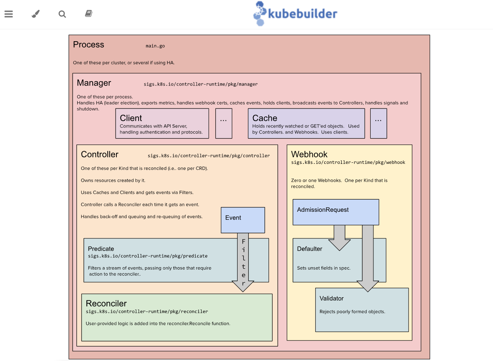

# Знакомимся с контроллерами и операторами kubernetes (k8s)

- [Знакомимся с контроллерами и операторами kubernetes (k8s)](#знакомимся-с-контроллерами-и-операторами-kubernetes-k8s)
  - [Практика - упрощаем написание контроллера с помощью kubebuilder (Простой путь)](#практика---упрощаем-написание-контроллера-с-помощью-kubebuilder-простой-путь)
    - [Учебная задача](#учебная-задача)
    - [План работы](#план-работы)
    - [1 - Что такое kubebuilder и архитектурная схема](#1---что-такое-kubebuilder-и-архитектурная-схема)
  - [Навигация](#навигация)

## Практика - упрощаем написание контроллера с помощью kubebuilder (Простой путь)

### Учебная задача

Создать crd который будет заниматься синхронизаций секретов - secretsynch. Требования к crd следующие:

- cdr должен иметь список следующих структур
  
  ```yaml
  spec:
    secretName: string
    srcNamespace: string
    dstNamespace: [string, string]
  status:
    lastSyncTime: Time 
  ```

  где,
  - secretName - имя секрета который надо скопировать в другие Namespace
  - srcNamespace - имя ns из которого копировать секрет
  - dstNamespace - список имен ns в которые надо скопировать секрет
  
- при изменении secretName в srcNamespace должны меняться секреты secretName в dstNamespace
- при удалении secretName в srcNamespace должны удаляться secretName в dstNamespace
- при изменении secretsynch изменения должны применяться

### План работы

[1. Что такое kubebuilder и архитектурная схема](kubebuilder_easy_way_p1.md#1---что-такое-kubebuilder-и-архитектурная-схема)
[2. Пишем mvp контроллера](kubebuilder_easy_way_p2.md#2---пишем-mvp-контроллера)
[3. Разбор проблем в mvp и приведение контроллера в соответствие с учебной задачей](kubebuilder_easy_way_p3.md#3---разбор-проблем-в-mvp-и-приведение-контроллера-в-соответствие-с-учебной-задачей)

### 1 - Что такое kubebuilder и архитектурная схема

Как пишут авторы kubebuilder в репозитории github, Kubebuilder — это фреймворк для создания API Kubernetes с использованием пользовательских определений ресурсов (CRD). Другими словами, это инструмент для упрощения написания операторов для kubernetes. Архитектурная схема у kubebuilder следующая (<https://book.kubebuilder.io/architecture>):


По схеме видно:

- есть клиентская часть, которая подключается к kube api-server.
- контроллер, имеет собственный локальный кеш, события из которого будут браться. На эти события будет срабатывать функция Reconsiller
- Predicat - фильтр, который позволяет разделять события на: создание, обновление и удаления.
- Reconsiller - функция, которая срабатывает по умолчанию на все события, с ресурсом, за которым наблюдает. В этой функции содержится бизнес-логика или другими словами алгоритм приведения того, что есть в кластере kube api-server к тому что мы хотим получить.(Пример: синхронизация configmap или secret между разными ns). Reconsiller должен быть идемпотентный, т.е. повторное выполнение операции не приводит к изменению состояния системы или ресурса. Лучше всего идемпотентность иллюстрирует эта картинка

    

## Навигация

- Организационная часть - требования по ПО, начальным знаниям и навигация по статье
  - [Требования](README.md#требования)
    - [Что нужно, перед тем как читать эту статью](README.md#что-нужно-перед-тем-как-читать-эту-статью)
    - [Используемые версии пакетов](README.md#используемые-версии-пакетов)
    - [Структура статьи](README.md#структура-статьи) 
- Теоретическая часть:
  - [Начнем издали или договоримся о понятиях](theoretical_part.md#начнем-издали-или-договоримся-о-понятиях) - некоторая информация по внутренней работе kubernetes, которая может быть полезной, для создания собственных контроллеров kubernetes.
    - [Ресурс](theoretical_part.md#ресурс)
    - [kube-apiserver](theoretical_part.md#kube-apiserver)
    - [CDR](theoretical_part.md#crd)
    - [kube-controller-manager](theoretical_part.md#kube-controller-manager)
    - [controller vs operator](theoretical_part.md#controller-vs-operator)
    - [Watch](theoretical_part.md#watch)
    - [Informer](theoretical_part.md#informer)
  - [Навигация](theoretical_part.md#навигация) 
- Практическая часть поделена на несколько файлов:
  - [Практика - упрощаем написание контроллера с помощью kubebuilder (Простой путь)](kubebuilder_easy_way_p1.md#практика---упрощаем-написание-контроллера-с-помощью-kubebuilder-простой-путь)
    - [Учебная задача](kubebuilder_easy_way_p1.md#учебная-задача)
    - [План работы](kubebuilder_easy_way_p1.md#план-работы)
    - [1 - Что такое kubebuilder и архитектурная схема](theoretical_part.md#1---что-такое-kubebuilder-и-архитектурная-схема)
  - [Навигация](kubebuilder_easy_way_p1.md#навигация) **<- вы здесь.**
    - [2 - Пишем mvp контроллера](kubebuilder_easy_way_p2.md#2---пишем-mvp-контроллера)
      - [2.1 Создание проекта](kubebuilder_easy_way_p2.md#21-создание-проекта)
      - [2.2 Создание CRD и его добавление к k8s](kubebuilder_easy_way_p2.md#22-создание-crd-и-его-добавление-к-k8s)
      - [2.3 Логика работы контроллера и его запуск](kubebuilder_easy_way_p2.md#23-логика-работы-контроллера-и-его-запуск)
        - [2.3.1 Логика работы контроллера](kubebuilder_easy_way_p2.md#231-логика-работы-контроллера)
        - [2.3.2 Запуск контроллера](kubebuilder_easy_way_p2.md#232-запуск-контроллера)
      - [2.4 Добавление нового CR SecSynch, ns, secret](kubebuilder_easy_way_p2.md#24-добавление-нового-cr-secsynch-ns-secret)
  - [Навигация](kubebuilder_easy_way_p2.md#навигация)
    - [3 - Разбор проблем в mvp и приведение контроллера в соответствие с учебной задачей](kubebuilder_easy_way_p3.md#3---разбор-проблем-в-mvp-и-приведение-контроллера-в-соответствие-с-учебной-задачей)
      - [3.1 Удаление объекта `SecSynch secretsync-a` не удаляет скопированные секреты](kubebuilder_easy_way_p3.md#31-удаление-объекта-secsynch-secretsync-a-не-удаляет-скопированные-секреты)
      - [3.2 Обновление секрета `secret-a` не вызывает обновление уже созданных ранее секретов](kubebuilder_easy_way_p3.md#32-обновление-секрета-secret-a-не-вызывает-обновление-уже-созданных-ранее-секретов)
      - [3.3 Ложные срабатывания `Reconsille` на изменения ресурсов](kubebuilder_easy_way_p3.md#33-ложные-срабатывания-reconsille-на-изменения-ресурсов)
  - [Навигация](kubebuilder_easy_way_p3.md#навигация)

[Предыдущее](theoretical_part.md)
[Далее](kubebuilder_easy_way_p2.md)
