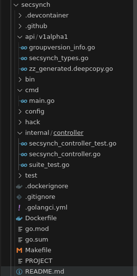

# Знакомимся с контроллерами и операторами kubernetes (k8s)

- [Знакомимся с контроллерами и операторами kubernetes (k8s)](#знакомимся-с-контроллерами-и-операторами-kubernetes-k8s)
  - [Практика - упрощаем написание контроллера с помощью kubebuilder (Простой путь)](#практика---упрощаем-написание-контроллера-с-помощью-kubebuilder-простой-путь)
    - [2 - Пишем mvp контроллера](#2---пишем-mvp-контроллера)
      - [2.1 Создание проекта](#21-создание-проекта)
      - [2.2 Создание CRD и его добавление к k8s](#22-создание-crd-и-его-добавление-к-k8s)
      - [2.3 Логика работы контроллера и его запуск](#23-логика-работы-контроллера-и-его-запуск)
        - [2.3.1 Логика работы контроллера](#231-логика-работы-контроллера)
        - [2.3.2 Запуск контроллера](#232-запуск-контроллера)
      - [2.4 Добавление нового CR SecSynch, ns, secret](#24-добавление-нового-cr-secsynch-ns-secret)
  - [Навигация](#навигация)

## Практика - упрощаем написание контроллера с помощью kubebuilder (Простой путь)

### 2 - Пишем mvp контроллера

#### 2.1 Создание проекта

Начнем с описания группы kube api-server и ресурса в CRD. Это нужно чтобы правильно задать аргументы kubebuilder

```yaml
apiVersion: tutorial.study.dev/v1alpha1
kind: SecSynch
```

где,

- group = tutorial
- domain = study.dev
- version = v1alpha1

Команда в терминале

```bash
mkdir -p secsynch
cd secsynch
# repo - имя используемое для модуля
# kubebuilder init создает проект с папками, но без cdr и контроллера
kubebuilder init --domain study.dev --repo=operator_tutorial/secsynch
# kubebuilder create api создает API с группой tutorial.study.dev и версией v1alpha1, уникальный идентификатор для ресурса SecSynch
kubebuilder create api --group tutorial --version v1alpha1 --kind SecSynch
```

Теперь создана такая структура файлов и папок.



Для написания контроллера достаточно внести правки в 2 файла:

- `secsynch/api/v1alpha1/secsynch_types.go` (описание структуры CRD)
- `secsynch/internal/controller/secsynch_controller.go` (логика работы контроллера)

Но немного о структуре и сгенерированных файлах:

- В файле `secsynch/api/v1alpha1/groupversion_info.go` переменные с группой

  

- В файле `secsynch/cmd/main.go` создается контроллер, который подключается к kube api-server. Функция `ctrl.GetConfigOrDie()` пытается найти файл `~/.kube/config` или получить токен для работы из примонтированного в pod serviceaccount (если программа собрана в докере и запущена в кластере как deployment).

  

- Тот же `main.go`. Создается новая структура `SecSynchReconciler` и ее функция `SetupWithManager,` запускается наблюдение за кастомный ресурсом (secsynch). Если надо внести правки в работу контроллера, то необходимо менять функцию `SetupWithManager` в файле `secsynch/internal/controller/secsynch_controller.go` .

  

#### 2.2 Создание CRD и его добавление к k8s

Структура CDR задается в файле `secsynch/api/v1alpha1/secsynch_types.go`. Файл уже заранее сгенерирован.

в secsynch_types.go надо добавить только представление spec и status из манифеста secsynch.yaml в виде структуры в go.
Добавим в файл следующий код:

```go
type SecSynchSpec struct {
  SourceNamespace       string   `json:"sourceNamespace"`
  DestinationNamespaces []string `json:"destinationNamespaces"`
  SecretName            string   `json:"secretName"`
}

type SecSynchStatus struct {
  LastSyncTime metav1.Time `json:"lastSyncTime"`
}

// +kubebuilder:object:root=true
// +kubebuilder:subresource:status

// SecSynch is the Schema for the secsynches API.

type SecSynch struct {
  metav1.TypeMeta   `json:",inline"`
  metav1.ObjectMeta `json:"metadata,omitempty"`

  // перед SecSynchSpec ставим [], чтобы можно было хранить список 
  Spec   SecSynchSpec     `json:"spec,omitempty"`
  Status SecSynchStatus `json:"status,omitempty"`
}
```

Если нужна валидация для полей в CRD, это можно сделать с помощью специальных комментариев. Более подробная информация по валидации - <https://book.kubebuilder.io/reference/markers>.

Теперь можно генерировать CDR.

```bash
make manifests
```

Результат в файле `secsynch/config/crd/bases/tutorial.study.dev_secsynches.yaml` . Добавить новый CRD в kubernetes:

```bash
make install
# или
kubectl apply -f ./config/crd/bases/tutorial.study.dev_secsynches.yaml
```

Проверяем наличие нового ресурса


#### 2.3 Логика работы контроллера и его запуск

##### 2.3.1 Логика работы контроллера

Reconcile - основная функция, в которой содержится бизнес-логика. Эта функция вызывается при каждом event'е и пытается привести состояние ресурсов к желаемому. При запуске контроллера, контроллер получает все существующие CR SecSynch и вызывает для каждой из них Reconcile. Для контроллера это единственный вариант убедиться, что бизнес логика была применена ко всем объектам и ничего не упущено, за то время, пока контроллер не был запущен.

Функция Reconcile находится в файле `secsynch/internal/controller/secsynch_controller.go` . Строка

```go
//+kubebuilder:rbac:groups=core,resources=secrets,verbs=get;list;watch;create;update;patch;delete
```

системная для kubebuilder, она передает команду на создание RBAK для работы с секретами.

Необходимо импортировать зависимости в файл `secsynch/internal/controller/secsynch_controller.go`

```go
corev1 "k8s.io/api/core/v1"
metav1 "k8s.io/apimachinery/pkg/apis/meta/v1"
```

и добавить в функцию Reconcile код ниже. Комментарии в коде читать.

```go
//+kubebuilder:rbac:groups=core,resources=secrets,verbs=get;list;watch;create;update;patch;delete
func (r *SecSynchReconciler) Reconcile(ctx context.Context, req ctrl.Request) (ctrl.Result, error) {
  // в переменной req находится namespace/имя cd, который вызвал срабатывание Reconcile

  log := log.FromContext(ctx).WithValues("secsynch_tutorial", req.NamespacedName)
  log.Info("Reconsiller secsynch_tutorial start")

  // в r.Get передается имя Неймспейс/Имя ресурса (SecSynch), на который сработал Reconcile
  // если контроллер только запустился, то он получает список всех SecSynch в кластере и пытается применить бизнес логику

  // в r.Get тип ресурса (Pod, Deployment, Job) определяется по переменной, в которую надо записать результат, в нашем случае cr
  cr := &tutorialv1alpha1.SecSynch{}
  err := r.Get(ctx, req.NamespacedName, cr)
  if err != nil {
    if errors.IsNotFound(err) {
      // ситуация когда ресурс не найден в кластере - штатная, вызывать ошибку не нужно
      log.Info("Resource SecSynch not found, then it usually means that it was deleted")
      return ctrl.Result{}, nil
    }
    // в ином случае это нештатная ситуация и ошибка.
    // контроллер будет сыпать в логи ошибку и номер строки, на которой она произошла
    // так же кластер будет заново вызывать функцию Reconcile до победного конца.
    // Время между запросов увеличивается от 5 миллисекунд до 1000 секунд по экспоненте
    log.Error(err, "Failed to get SecSynch ")
    return ctrl.Result{}, err
  }

  // получаем секрет который надо скопировать
  sourceSecret := &corev1.Secret{}
  // req.NamespacedName такое же тип объекта как и types.NamespacedName{Namespace: cr.Spec.SourceNamespace, Name: cr.Spec.SecretName}
  err = r.Get(ctx, types.NamespacedName{Namespace: cr.Spec.SourceNamespace, Name: cr.Spec.SecretName}, sourceSecret)
  if err != nil {
    // штатный случай, просто нет секрета в кластере
    if errors.IsNotFound(err) {
      log.Info("Resource Secret not found, SecretName:", cr.Spec.SecretName, "SourceNamespace", cr.Spec.SourceNamespace, "try again in 3 minutes")
      // передаем команду - вызвать повторно функцию Reconcile
      // через 3 минуты, может тогда уже будет существовать секрет
      return ctrl.Result{RequeueAfter: 3 * time.Minute}, nil
    }
  }
  // перебираем ns в которых должен быть секрет
  for _, destNS := range cr.Spec.DestinationNamespaces {
    // запрашиваем секрет в ns куда надо его скопировать, вдруг он там уже есть.
    destSecret := &corev1.Secret{}
    err := r.Get(ctx, types.NamespacedName{Namespace: destNS, Name: cr.Spec.SecretName}, destSecret)
    // секрет в ns есть, ничего не делаем
    if err == nil {
      continue
    }
    // секрета в ns нет, создаем его
    if errors.IsNotFound(err) {
      log.Info("Creating Secret ", "destination namespace  is", destNS)
      destSecret = &corev1.Secret{
        ObjectMeta: metav1.ObjectMeta{
          Name:      sourceSecret.Name,
          Namespace: destNS,
        },
        // копируем содержимое секрета
        Data: sourceSecret.Data,
        }

      err_create := r.Create(ctx, destSecret)
      // ситуация когда ns еще нет и из-за этого не может создать секрет, пробуем позже
      if errors.IsNotFound(err_create) {
        log.Info("Namespace not found", "Namespace is", destNS)
        return ctrl.Result{RequeueAfter: 3 * time.Minute}, nil
      }
      if err_create != nil {
        log.Error(err_create, "Secret is not created in", " Namespace is ", destNS, " SecretName is ", sourceSecret.Name)
        return ctrl.Result{}, err_create
    }
    continue

    }
    // не смогли получить секрет, ошибка не из-за отсутствие объекта
    if err != nil {
      log.Error(err, "Not get secret ", "Name is", sourceSecret.Name, "in Namespace", destNS)
      return ctrl.Result{}, err
    }

  }

  // обновляем время успешной синхронизации секрета
  cr.Status.LastSyncTime = metav1.Now()
  if err := r.Status().Update(ctx, cr); err != nil {
    log.Error(err, "Unable to update secretsync status")
    return ctrl.Result{}, err
  }
  log.Info("Status secretsync updated", "LastSyncTime", cr.Status.LastSyncTime)

  return ctrl.Result{}, nil
}
```

##### 2.3.2 Запуск контроллера

Есть несколько вариантов:

1. в режиме отладки, командой `go run ./cmd/main.go` из папки `secsynch` , при условии что у вас есть файл  `~/.kube/config` от кластера
2. собрать докер образ самостоятельно или через команду `make docker-build IMG=secsynch:1.0.0` , далее опять развилка:
   1. доставить образ в кластер самостоятельно и написать манифест с новым образом тоже самостоятельно
   2. доставить и развернуть оператор в kubernetes средствами kubebuilder командой `make deploy IMG=secretsync:1.0.0`
   3. использовать смешанный вариант, когда образ доставляется в кластер самостоятельно, а манифесты создается с помощью того, что работает под капотом у команды `make deploy IMG=secretsync:1.0.0` -  сначала устанавливается kustomize, если его нет, а после вызывает такие команды:

    ```bash
    cd config/manager && /home/chimera/project/go/operators/secretsync/bin/kustomize edit set image controller=secretsync:1.0.0
    /home/chimera/project/go/operators/secretsync/bin/kustomize build config/default | kubectl apply -f -
    ```

    если не вызывать `| kubectl apply -f -` то в терминале будет сгенерировать манифесты, которые уже доставить в кластер k8s.

В дальнейшем предполагается, что контроллер развернут в кластере как deployment или запущен локально в тестовом режиме. Логи запущенного контроллера без cr.


#### 2.4 Добавление нового CR SecSynch, ns, secret

Для дальнейшей проверки работы добавим следующие объекты:

- Секрет который мы будем копировать.

  ```bash
  kubectl create secret generic secret-a \
      --from-literal=username=a \
      --from-literal=password='AaAaAa'
  ```

- Создаем 1 из 2-х namespace в которых будем копировать секрет

  ```bash
  kubectl create ns a1
  ```

- Создадим ресурс SecSynch в файле `./secretsync-a.yaml`

  ```yaml
  apiVersion: tutorial.study.dev/v1alpha1
  kind: SecSynch
  metadata:
    name: secretsync-a
    namespace: default
  spec:
    destinationNamespaces:
    - a1
    - a2
    secretName: secret-a
    sourceNamespace: default
  ```

Применим новый ресурс командой `kubectl apply -f ./secretsync-a.yaml`. В логах контроллера видим следующее


Контроллер увидел CR и попытался выполнить копирование секретов в 2 ns - `a1` и `a2`, но т.к. ns `a2` не существовало, контроллер отложил свой запуск на 3 минуты. Через 3 минуты ситуация повторилась, контроллер ушел ждать дальше. Создаем ns `a2` командой `kubectl create ns a2`. В логах видим следующее


Контроллер скопировал секрет `secret-a` в ns `a2`.

## Навигация

- Организационная часть - требования по ПО, начальным знаниям и навигация по статье
  - [Требования](README.md#требования)
    - [Что нужно, перед тем как читать эту статью](README.md#что-нужно-перед-тем-как-читать-эту-статью)
    - [Используемые версии пакетов](README.md#используемые-версии-пакетов)
    - [Структура статьи](README.md#структура-статьи) 
- Теоретическая часть:
  - [Начнем издали или договоримся о понятиях](theoretical_part.md#начнем-издали-или-договоримся-о-понятиях) - некоторая информация по внутренней работе kubernetes, которая может быть полезной, для создания собственных контроллеров kubernetes.
    - [Ресурс](theoretical_part.md#ресурс)
    - [kube-apiserver](theoretical_part.md#kube-apiserver)
    - [CDR](theoretical_part.md#crd)
    - [kube-controller-manager](theoretical_part.md#kube-controller-manager)
    - [controller vs operator](theoretical_part.md#controller-vs-operator)
    - [Watch](theoretical_part.md#watch)
    - [Informer](theoretical_part.md#informer)
  - [Навигация](theoretical_part.md#навигация) 
- Практическая часть поделена на несколько файлов:
  - [Практика - упрощаем написание контроллера с помощью kubebuilder (Простой путь)](kubebuilder_easy_way_p1.md#практика---упрощаем-написание-контроллера-с-помощью-kubebuilder-простой-путь)
    - [Учебная задача](kubebuilder_easy_way_p1.md#учебная-задача)
    - [План работы](kubebuilder_easy_way_p1.md#план-работы)
    - [1 - Что такое kubebuilder и архитектурная схема](theoretical_part.md#1---что-такое-kubebuilder-и-архитектурная-схема)
  - [Навигация](kubebuilder_easy_way_p1.md#навигация)
    - [2 - Пишем mvp контроллера](kubebuilder_easy_way_p2.md#2---пишем-mvp-контроллера)
      - [2.1 Создание проекта](kubebuilder_easy_way_p2.md#21-создание-проекта)
      - [2.2 Создание CRD и его добавление к k8s](kubebuilder_easy_way_p2.md#22-создание-crd-и-его-добавление-к-k8s)
      - [2.3 Логика работы контроллера и его запуск](kubebuilder_easy_way_p2.md#23-логика-работы-контроллера-и-его-запуск)
        - [2.3.1 Логика работы контроллера](kubebuilder_easy_way_p2.md#231-логика-работы-контроллера)
        - [2.3.2 Запуск контроллера](kubebuilder_easy_way_p2.md#232-запуск-контроллера)
      - [2.4 Добавление нового CR SecSynch, ns, secret](kubebuilder_easy_way_p2.md#24-добавление-нового-cr-secsynch-ns-secret)
  - [Навигация](kubebuilder_easy_way_p2.md#навигация) **<- вы здесь.**
    - [3 - Разбор проблем в mvp и приведение контроллера в соответствие с учебной задачей](kubebuilder_easy_way_p3.md#3---разбор-проблем-в-mvp-и-приведение-контроллера-в-соответствие-с-учебной-задачей)
      - [3.1 Удаление объекта `SecSynch secretsync-a` не удаляет скопированные секреты](kubebuilder_easy_way_p3.md#31-удаление-объекта-secsynch-secretsync-a-не-удаляет-скопированные-секреты)
      - [3.2 Обновление секрета `secret-a` не вызывает обновление уже созданных ранее секретов](kubebuilder_easy_way_p3.md#32-обновление-секрета-secret-a-не-вызывает-обновление-уже-созданных-ранее-секретов)
      - [3.3 Ложные срабатывания `Reconsille` на изменения ресурсов](kubebuilder_easy_way_p3.md#33-ложные-срабатывания-reconsille-на-изменения-ресурсов)
  - [Навигация](kubebuilder_easy_way_p3.md#навигация)

[Предыдущее](kubebuilder_easy_way_p1.md)
[Далее](kubebuilder_easy_way_p3.md)
