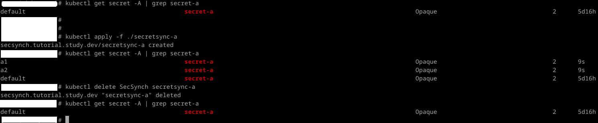
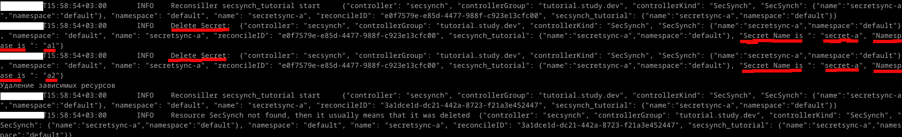
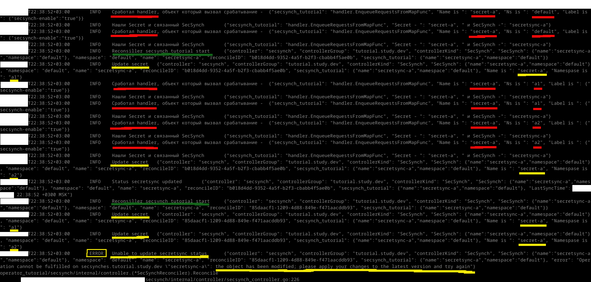
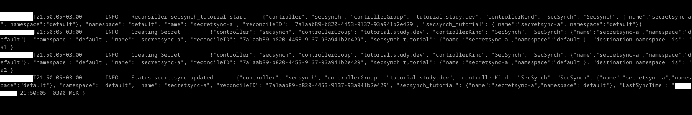
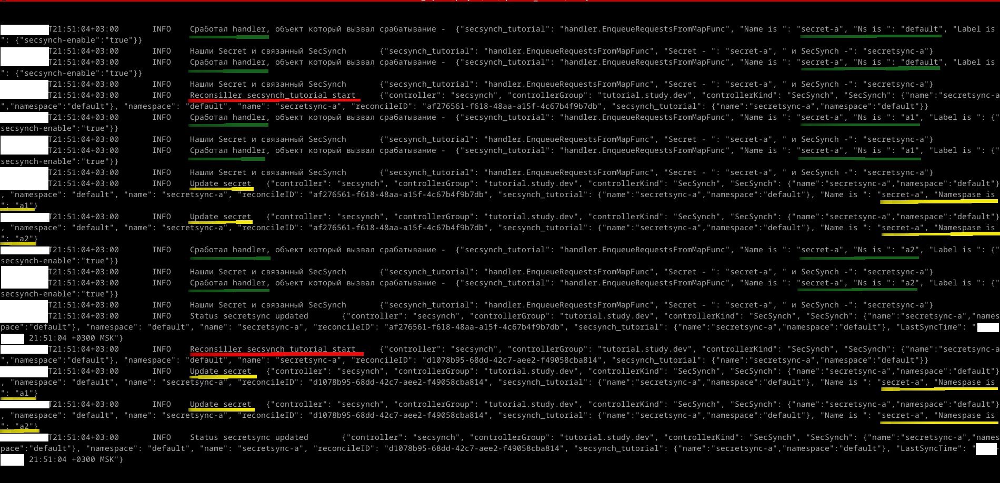

# Знакомимся с контроллерами и операторами kubernetes (k8s)

- [Знакомимся с контроллерами и операторами kubernetes (k8s)](#знакомимся-с-контроллерами-и-операторами-kubernetes-k8s)
  - [Практика - упрощаем написание контроллера с помощью kubebuilder (Простой путь)](#практика---упрощаем-написание-контроллера-с-помощью-kubebuilder-простой-путь)
    - [3 - Разбор проблем в mvp и приведение контроллера в соответствие с учебной задачей](#3---разбор-проблем-в-mvp-и-приведение-контроллера-в-соответствие-с-учебной-задачей)
      - [3.1 Удаление объекта `SecSynch secretsync-a` не удаляет скопированные секреты](#31-удаление-объекта-secsynch-secretsync-a-не-удаляет-скопированные-секреты)
      - [3.2 Обновление секрета `secret-a` не вызывает обновление уже созданных ранее секретов](#32-обновление-секрета-secret-a-не-вызывает-обновление-уже-созданных-ранее-секретов)
      - [3.3 Ложные срабатывания `Reconsille` на изменения ресурсов](#33-ложные-срабатывания-reconsille-на-изменения-ресурсов)
  - [Навигация](#навигация)

## Практика - упрощаем написание контроллера с помощью kubebuilder (Простой путь)

### 3 - Разбор проблем в mvp и приведение контроллера в соответствие с учебной задачей

- Удаление объекта `SecSynch secretsync-a` не удаляет скопированные секреты.
- Обновление секрета `secret-a` не вызывает обновление уже созданных ранее секретов.
- Ложные срабатывания функции `Reconsille` на изменения ресурсов (Обновление даты синхронизации cr SecSynch secretsync-a вызывает запуск `Reconsille` заново, т.к. происходит событие `update SecSynch`. В текущей реализации это не страшно, но при большом количестве секретов может давать большую нагрузку на сервер kube api-server.)

#### 3.1 Удаление объекта `SecSynch secretsync-a` не удаляет скопированные секреты

Для реализации этого требования нужно использовать механизм Finalizers - дока [Kubernetes](https://kubernetes.io/docs/tasks/extend-kubernetes/custom-resources/custom-resource-definitions/#finalizers). В документации пишут, что Finalizers позволяют контроллерам реализовывать асинхронные хуки pre-delete. На практике это выглядит следующим образом:

- ресурс (`SecSynch secretsync-a`) помещается в finalizers (список)
- пока ресурс `SecSynch secretsync-a` находится в этой структуре вместо удаления объекта на него вещается метка `metadata.deletionTimestamp`
- после этого ресурс можно только удалить из списка Finalizers или прочитать его из кэша, другие действия с ним не доступны
- до того как произошло удаление ресурса `SecSynch secretsync-a` можно выполнить дополнительную логику, в случае учебной задачи найти скопированные секреты и удалить их.
- после удаления ресурса `SecSynch secretsync-a` из Finalizers сервер kube api-server удаляет ресурс без создания новых событий

У Finalizers есть стандартный формат - "доменное имя/finalizer" . Для текущей учебной задачи это будет выглядеть так:

```yaml
apiVersion: tutorial.study.dev/v1alpha1
kind: SecSynch
metadata:
  finalizers:
  - tutorial.study.dev/finalizer
```

Для реализации работы Finalizers нужны следующие правки в коде файла `secsynch/internal/controller/secsynch_controller.go`:

- добавим еще одну библиотеку в импорт

```go
"sigs.k8s.io/controller-runtime/pkg/controller/controllerutil"
```

- добавим код в функцию Reconcile (код Finalaizer обрамлен //////////////////////)

```go
func (r *SecSynchReconciler) Reconcile(ctx context.Context, req ctrl.Request) (ctrl.Result, error) {
  // в переменной req находится namespace/имя cd, который вызвал срабатывание Reconcile

  log := log.FromContext(ctx).WithValues("secsynch_tutorial", req.NamespacedName)
  log.Info("Reconsiller secsynch_tutorial start")

  // в r.Get передается имя Неймспейс/Имя ресурса (SecSynch), на который сработал Reconcile
  // если контроллер только запустился, то он получает список всех SecSynch в кластере и пытается применить бизнес логику

  // в r.Get тип ресурса (Pod, Deployment, Job) определяется по переменной, в которую надо записать результат, в нашем случае cr
  cr := &tutorialv1alpha1.SecSynch{}
  err := r.Get(ctx, req.NamespacedName, cr)
  if err != nil {
    if errors.IsNotFound(err) {
      // ситуация когда ресурс не найден в кластере - штатная, вызывать ошибку не нужно
      log.Info("Resource SecSynch not found, then it usually means that it was deleted")
      return ctrl.Result{}, nil
    }
    // в ином случае это нештатная ситуация и ошибка.
    // контроллер будет сыпать в логи ошибку и номер строки, на которой она произошла
    // так же кластер будет заново вызывать функцию Reconcile до победного конца.
    // Время между запросов увеличивается от 5 миллисекунд до 1000 секунд по экспоненте
    log.Error(err, "Failed to get SecSynch ")
    return ctrl.Result{}, err
  }

  //////////////////////  Реализация удаления зависимых объектов с помощью Finalaizer

  // наш finalizer
  myFinalizerName := "tutorial.study.dev/finalizer"

  // проверяем удаляется объект или нет
  // если объект с меткой DeletionTimestamp, то была команда на его удаление,
  // если метки нет, объект не пытались удалить
  if cr.ObjectMeta.DeletionTimestamp.IsZero() {
    // Объект не удаляется, предполагаем что объект только создан
    // и надо его добавить в Finalaizer, чтобы при удалении SecSynch
    // выполнилась дополнительная логика
    if !controllerutil.ContainsFinalizer(cr, myFinalizerName) {
      controllerutil.AddFinalizer(cr, myFinalizerName)
      if err := r.Update(ctx, cr); err != nil {
        log.Error(err, "Failed to added finalaizer to SecSynch")
        return ctrl.Result{}, err
      }
    }
    // метка DeletionTimestamp есть, объект удаляется
  } else {
    // проверка что на нашем ресурсу есть finalizer.
    // на всякий случай убедимся что finalizer есть

    if controllerutil.ContainsFinalizer(cr, myFinalizerName) {
      // выполняем доп логику при удалении SecSynch
      if err := r.deleteExternalResources(ctx, log, cr); err != nil {
        // ошибка функции, вывод логов
        log.Error(err, "Failed to run deleteExternalResources")
        return ctrl.Result{}, err
      }

      // удалим наш finalizer из списка и обновим его.
      controllerutil.RemoveFinalizer(cr, myFinalizerName)
      if err := r.Update(ctx, cr); err != nil {
        log.Error(err, "Failed to remove finalaizer to SecSynch")
        return ctrl.Result{}, err
      }
    }
    // Дополнительная логика при удалении ресурса SecSynch выполнена
    // можно выходить из Reconcile
    // сервер kube api-server удалит окончательно
    // ресурс SecSynch без создания новых событий (events )
    return ctrl.Result{}, nil
  }
  /////////////////////////////////// Реализация удаления зависимых объектов (Finalaizer)

  // получаем секрет который надо скопировать
  sourceSecret := &corev1.Secret{}
```

- реализовать функцию `deleteExternalResources`

```go
func (r *SecSynchReconciler) deleteExternalResources(ctx context.Context, log logr.Logger, cr *tutorialv1alpha1.SecSynch) error {

  for _, destNS := range cr.Spec.DestinationNamespaces {
    err := r.Delete(ctx, &corev1.Secret{
      ObjectMeta: metav1.ObjectMeta{
        Name:      cr.Spec.SecretName,
        Namespace: destNS,
      },
    })
    if err != nil || errors.IsNotFound(err) {
      log.Error(err, "Secret not delete", "Secret is ", cr.Spec.SecretName, "Namespace of secret is", destNS)
      return err
    }
    log.Info("Delete Secret:", "Secret Name is ", cr.Spec.SecretName, "Namespace is ", destNS)
  }

  fmt.Println("Удаление зависимых ресурсов")
  return nil
  }
```

Проверка работы кода в терминале:

1. проверка что исходный секрет всего один
2. создание `SecSynch secretsync-a`
3. проверка что секреты есть в других namespace
4. удаление `SecSynch secretsync-a`
5. проверка, что секрет удален из других namespace
  


Логи контроллера при реализации Finalaizer


#### 3.2 Обновление секрета `secret-a` не вызывает обновление уже созданных ранее секретов

В kubebuilder есть 2 варианта наблюдения за ресурсами: через метку Owner или как NOT Owned. Рассмотрим их подробнее.

- Наблюдение за вторым ресурсом через метку `metadata.ownerReferences`. Этот вариант использует механизм [kubernetes](https://kubernetes.io/docs/concepts/overview/working-with-objects/owners-dependents/), который ставит на объект метку с uid родительского ресурса. Родительский и дочерний объект должны быть в одном namespace. По этому в текущей учебной задаче этот вариант не подходит. Пример установки метки:

  ```go
  import ctrl "sigs.k8s.io/controller-runtime"
  ...
  ...
  ...
  if err := ctrl.SetControllerReference(parent_resource, child_resource, r.Scheme); err != nil {
          return nil, err
      }
  ```

  Наблюдение за ресурсом в kubebuilder включается так:

  ```go
  // SetupWithManager sets up the controller with the Manager.
  // The controller will watch both the Busybox primary resource and the Deployment secondary resource.
  func (r *BusyboxReconciler) SetupWithManager(mgr ctrl.Manager) error {
      return ctrl.NewControllerManagedBy(mgr).
          For(&tutorialv1alpha1.SecSynch{}).  // Наблюдение за основным ресурсом
          Owns(&appsv1.Deployment{}).         // Наблюдение за дочерним ресурсом, для примера указан, Deployment, хотя в текущей учебной задачи он не используется 
          Complete(r)
  }
  ```

- Наблюдение за вторым ресурсом, который не дочерний (NOT Owned). В kubebuilder к этому типу относят ресурсы за пределами k8s (сервер с бэкапами, другой кластер) или ресурс другого контроллера, который не возможно связать меткой `metadata.ownerReferences` . Это подходит для текущей учебной задачи. Перед реализацией надо подсветить несколько технических моментов. Для наблюдения за вторым ресурсом (Secret) создается watcher, который реагирует на все ресурсы данного типа и вызывает срабатывание. При старте контроллера будут браться все уже созданные ресурсы и вызывать срабатывание `Reconcile` для `SecSynchReconciler`. В большинстве случаев эти `Secret` не будут связаны с `SecSynch` и чтобы отсортировать секреты, введем метку `secsynch-enable: true`, на секреты, указанные в `SecSynch`.
  Правка в коде, файл `secsynch/internal/controller/secsynch_controller.go`
  - Добавить пакеты в import

    ```go
    import{
      "sigs.k8s.io/controller-runtime/pkg/handler"
      "sigs.k8s.io/controller-runtime/pkg/reconcile"
    }
    ```

  - Модифицировать функцию Reconcile, так чтобы:
    - на sourseSecret и на копированные секреты ставилась метка `secsynch-enable: true`
    - если уже есть копированный секрет в DestinationNamespaces, то он обновляется.

    ```go
    // получаем секрет который надо скопировать
    sourceSecret := &corev1.Secret{}
    // req.NamespacedName такое же тип объекта как и types.NamespacedName{Namespace: cr.Spec.SourceNamespace, Name: cr.Spec.SecretName}
    err = r.Get(ctx, types.NamespacedName{Namespace: cr.Spec.SourceNamespace, Name: cr.Spec.SecretName}, sourceSecret)
    if err != nil {
      // штатный случай, просто нет секрета в кластере
      if errors.IsNotFound(err) {
        log.Info("Resource Secret not found, SecretName:", cr.Spec.SecretName, "SourceNamespace", cr.Spec.SourceNamespace, "try again in 3 minutes")
        // передаем команду - вызвать повторно функцию Reconcile
        // через 3 минуты, может тогда уже будет существовать секрет
        return ctrl.Result{RequeueAfter: 3 * time.Minute}, nil
      }
    }

    //// Обновление секрета `secret-a` не вызывает обновление уже созданных ранее секретов (ч.1) ////

    // Чтобы отсортировать секреты на те которые имеют отношение к ресурсу SecSynch
    // и все остальные добавляем метку "secsynch-enable: true" если нужно
    if sourceSecret.Labels["secsynch-enable"] != "true" {
      sourceSecret.SetLabels(map[string]string{
        "secsynch-enable": "true",
      })
      err = r.Update(ctx, sourceSecret)
      if err != nil {
        log.Error(err, "Error adding label to secret", " Namespace is ", sourceSecret.Namespace, " SecretName is ", sourceSecret.Name)
        return ctrl.Result{}, err
      }
    }
    //// Обновление секрета `secret-a` не вызывает обновление уже созданных ранее секретов (ч.1 конец)  ////

    // перебираем ns в которых должен быть секрет
    for _, destNS := range cr.Spec.DestinationNamespaces {
      // запрашиваем секрет в ns куда надо его скопировать, вдруг он там уже есть.
      destSecret := &corev1.Secret{}
      err := r.Get(ctx, types.NamespacedName{Namespace: destNS, Name: cr.Spec.SecretName}, destSecret)

      // секрета в ns нет, создаем его
      if errors.IsNotFound(err) {
        log.Info("Creating Secret ", "destination namespace  is", destNS)

        err_create := r.Create(ctx, &corev1.Secret{
          ObjectMeta: metav1.ObjectMeta{
            Name:      sourceSecret.Name,
            Namespace: destNS,
            // переносим метки из оригинального секрета,
            // в том числе и "secsynch-enable: true"
            Labels: sourceSecret.Labels,
          },
          // копируем содержимое секрета
          Data: sourceSecret.Data,
        })
        // ситуация когда ns еще нет и из-за этого не может создать секрет, пробуем позже
        if errors.IsNotFound(err_create) {
          log.Info("Namespace not found", "Namespace is", destNS)
          return ctrl.Result{RequeueAfter: 3 * time.Minute}, nil

        }
        if err_create != nil {
          log.Error(err_create, "Secret is not created in", " Namespace is ", destNS, " SecretName is ", sourceSecret.Name)
          return ctrl.Result{}, err_create
        }
        continue

      }
      // не смогли получить секрет, ошибка не из-за отсутствие объекта
      if err != nil {
        log.Error(err, "Not get secret ", "Name is", sourceSecret.Name, "in Namespace", destNS)
        return ctrl.Result{}, err
      }

      //// Обновление секрета `secret-a` не вызывает обновление уже созданных ранее секретов (ч.2) ////

      // секрет в ns есть, пытаемся его обновить, возможно
      // вызов Reconcile произошло из-за обновления секрета
      destSecret.Data = sourceSecret.Data
      destSecret.Labels = sourceSecret.Labels
      err_update := r.Update(ctx, destSecret)
      if err_update != nil {
        log.Error(err_update, "Secret is not update in", " Namespace is ", destNS, " SecretName is ", sourceSecret.Name)
        return ctrl.Result{}, err_update
      }
      log.Info("Update secret", "Name is ", sourceSecret.Name, "Namespace is ", destNS)
      //// Обновление секрета `secret-a` не вызывает обновление уже созданных ранее секретов (ч.2 конец) ////

    }
    ```

  - Внести правку в функцию SetupWithManager

    ```go
    // Запуск контроллера
    func (r *SecSynchReconciler) SetupWithManager(mgr ctrl.Manager) error {
      return ctrl.NewControllerManagedBy(mgr).
        For(&tutorialv1alpha1.SecSynch{}).

        //// Обновление секрета `secret-a` не вызывает обновление уже созданных ранее секретов (ч.3) ////

        // описываем ресурс за которым наблюдаем и действия, которые происходят при наблюдении
        Watches(
          &corev1.Secret{}, // Наблюдение за секретами в кластере

          // функция которая срабатывает, при изменении ресурса Secret
          // требуется, чтобы возвращался CR SecSynch
          handler.EnqueueRequestsFromMapFunc(func(ctx context.Context, obj client.Object) []reconcile.Request {
            log := log.FromContext(ctx).WithValues("secsynch_tutorial", "handler.EnqueueRequestsFromMapFunc")
            // результат работы handler.
            // Функция должна вернуть вызов Reconcile
            // если SecSynch не будет найден, то вернется пустой slice
            res := []reconcile.Request{}

            log.Info("Сработал handler, объект который вызвал срабатывание - ", "Name is ", obj.GetName(), "Ns is ", obj.GetNamespace(), "Label is ", obj.GetLabels())

            // есть смысл вызвать тот SecSynch, в котором указан измененный секрет
            // для уменьшения запросов с kube api-server, проверяем метки в секретах.
            // Если метка есть, то ищем какому к SecSynch относится этот секрет
            if val, ok := obj.GetLabels()["secsynch-enable"]; ok && val == "true" {

              // получаем все SecSynch от kube api-server
              var cr tutorialv1alpha1.SecSynchList
              if err := r.List(ctx, &cr, client.InNamespace("")); err != nil {
                log.Error(err, "unable to list SecSynchList")
                return []reconcile.Request{}
              }
              // просматриваем все SecSynch и смотрим, в каком из них указан текущий секрет
              for _, secsynch := range cr.Items {
                if obj.GetName() == secsynch.Spec.SecretName {
                  // нашли SecSynch и добавляем его в slice
                  res = append(res, reconcile.Request{
                    NamespacedName: types.NamespacedName{
                      Name:      secsynch.Name,
                      Namespace: secsynch.Namespace,
                    },
                  })
                  log.Info("Нашли Secret и связанный SecSynch", "Secret - ", obj.GetName(), " и SecSynch -", secsynch.Name)
                }
              }
            }
            // возвращаем результат, если ничего не нашли,
            // то это аналогично
            // return []reconcile.Request{}
            return res

          }),
        ).
        //// Обновление секрета `secret-a` не вызывает обновление уже созданных ранее секретов (ч.3 конец) ////

        Named("secsynch").
        Complete(r)
    }
    ```

После внесения правок, запуска контроллера и изменения значение пароля в секрете `secret-a` namespace `default`


- Красный цвет подчеркивает моменты, когда срабатывает функция `handler.EnqueueRequestsFromMapFunc` из-за event secret в kube api-server.
- Зеленый цвет - запуск Reconsiller который вызвал `handler.EnqueueRequestsFromMapFunc`
- Желтый цвет - обновление секретов внутри функции `Reconcile`

Если посмотреть скрин логов, то можно увидеть, что `handler.EnqueueRequestsFromMapFunc` срабатывает 2 раза. Первый раз из-за того что поменяли пароль в секрете. Второй раз из-за того что kube api-server поменял поле с версией ресурса. Второе срабатывает `handler.EnqueueRequestsFromMapFunc` явно лишнее. Дальше меняется содержимое 2-х секретов `secret-a` в namespace `a1` и `a2` . Снова в логах по 2 срабатывания на каждый секрет. В конце функции `Reconcile` обновляется поле `status.lastSyncTime` в `SecSynch`, что опять вызывает срабатывание `Reconcile`. Опять попытка обновить все секреты, и в конце ошибка из-за того что изменения секрете `secret-a` namespace `default` не успели подтянуться в контроллер и обновление было отклонено kube api-server. Итого, если раньше была проблема ложного срабатывания `Reconcile` контроллер `SecSynch` только на правку ресурсов `SecSynch`, то теперь еще и правка секретов генерирует лишние срабатывания. С этой ситуацией надо что-то делать. Подробнее об этом далее.

#### 3.3 Ложные срабатывания `Reconsille` на изменения ресурсов

Для реализации этого требования используем Predicat. Он представляет собой набор функция на каждый возможный event наблюдаемого ресурса.

В файле `secsynch/internal/controller/secsynch_controller.go` создадим переменные в функции `SetupWithManager`

```go
  // Предикат
  predSecret := predicate.Funcs{
    // Функция для события update, исключаем срабатывание на добавление меток
    UpdateFunc: func(e event.UpdateEvent) bool {
      oldObj := e.ObjectOld.(*corev1.Secret)
      newObj := e.ObjectNew.(*corev1.Secret)

      // Триггер сработает, если функция вернет true, true будет если будет отличаться поле spec.data в секрете
      return !reflect.DeepEqual(oldObj.Data, newObj.Data)

    },

    // Ресурс SecSynch пытается скопировать секрет, которого нет
    // то SecSynch будет пробовать снова и снова с 3-х
    // минутным промежутком пока не добьется успеха.
    // В таком случае не требуется вызывать Reconsille еще и по событию создания секрета.
    CreateFunc: func(e event.CreateEvent) bool {
      return false
    },

    // Событие удаление
    DeleteFunc: func(e event.DeleteEvent) bool {
      return true
    },

    // Общие события (например, внешние триггеры)
    GenericFunc: func(e event.GenericEvent) bool {
      return true
    },
  }

  predSecSynch := predicate.Funcs{
    // Функция для события update, исключаем срабатывание на
    // добавление меток и времени последней синхронизации для SecSynch
    UpdateFunc: func(e event.UpdateEvent) bool {
      oldObj := e.ObjectOld.(*tutorialv1alpha1.SecSynch)
      newObj := e.ObjectNew.(*tutorialv1alpha1.SecSynch)

      return !reflect.DeepEqual(oldObj.Spec, newObj.Spec)

    },

    CreateFunc: func(e event.CreateEvent) bool {
      return true
    },

    DeleteFunc: func(e event.DeleteEvent) bool {
      return true
    },

    GenericFunc: func(e event.GenericEvent) bool {
      return true
    },
  }
```

Переменные в которых сохранены логические функции на все возможные события. Один набор функций будет использован для ресурса `secret`, второй набор функций для  `SecSynch`. Далее эти переменные надо передать в контроллер, который общается с kube api-server, (внутри функции SetupWithManager).

```go
  return ctrl.NewControllerManagedBy(mgr).
    For(&tutorialv1alpha1.SecSynch{}, builder.WithPredicates(predSecSynch)). // предикат для наблюдения за SecSynch
                                                                              // можно описать функции предиката без 
                                                                              // переменной, с помощью builder.Predicates{}).
    Watches(
      &corev1.Secret{}, 
      handler.EnqueueRequestsFromMapFunc(func(ctx context.Context, obj client.Object) []reconcile.Request {
        log := log.FromContext(ctx).WithValues("secsynch_tutorial", "handler.EnqueueRequestsFromMapFunc")
        res := []reconcile.Request{}
        log.Info("Сработал handler, объект который вызвал срабатывание - ", "Name is ", obj.GetName(), "Ns is ", obj.GetNamespace(), "Label is ", obj.GetLabels())
        if val, ok := obj.GetLabels()["secsynch-enable"]; ok && val == "true" {
          var cr tutorialv1alpha1.SecSynchList
          if err := r.List(ctx, &cr, client.InNamespace("")); err != nil {
            log.Error(err, "unable to list SecSynchList")
            return []reconcile.Request{}
          }
          for _, secsynch := range cr.Items {
            if obj.GetName() == secsynch.Spec.SecretName {
              res = append(res, reconcile.Request{
                NamespacedName: types.NamespacedName{
                  Name:      secsynch.Name,технической задачи 
                  Namespace: secsynch.Namespace,
                },
              })
              log.Info("Нашли Secret и связанный SecSynch", "Secret - ", obj.GetName(), " и SecSynch -", secsynch.Name)
            }
          }
        }
        return res

      }), builder.WithPredicates(predSecret), // предикат для наблюдения за Secret
    ).
    Named("secsynch").
    Complete(r)
```

Для проверки работы контроллера, удалим существующий `SecSynch secretsync-a` и `Secret secret-a namespace default`, а топом создадим их заново (сначала Secret, без метки `secsynch-enable: true`, потом SecSynch, чтобы не ждать 3 минуты между попытками копирования секрета).


- На скрине видно, что `Reconsille` вызывается только 1 раз, обновление поля `status.lastSyncTime` - не вызывает повторного срабатывания, сработала функция в предикате на событие обновление `SecSynch`.
- Обновление `Secret secret-a namespace default` (добавили метку `secsynch-enable: true`) не вызывает срабатывание `Reconsille`, сработала функция в предикате на событие обновление `Secret`.
- Создание `Secret secret-a namespace a1` и `Secret secret-a namespace a2`, сработала функция в предикате на событие создание `Secret`.

Обновление пароля в секрете проходит лучше, есть лишнее срабатывание после обновлений секретов в `destNamespace`, но цепной реакции вызовов Reconsille, которая заканчивается ошибкой из-за расхождения данных в контроллере и kub api-server уже не происходит.


При желании и в зависимости от требований можно доработать текущую учебную задачу, но для ознакомления текущей реализации достаточно.

## Навигация

- Организационная часть - требования по ПО, начальным знаниям и навигация по статье
  - [Требования](README.md#требования)
    - [Что нужно, перед тем как читать эту статью](README.md#что-нужно-перед-тем-как-читать-эту-статью)
    - [Используемые версии пакетов](README.md#используемые-версии-пакетов)
    - [Структура статьи](README.md#структура-статьи) 
- Теоретическая часть:
  - [Начнем издали или договоримся о понятиях](theoretical_part.md#начнем-издали-или-договоримся-о-понятиях) - некоторая информация по внутренней работе kubernetes, которая может быть полезной, для создания собственных контроллеров kubernetes.
    - [Ресурс](theoretical_part.md#ресурс)
    - [kube-apiserver](theoretical_part.md#kube-apiserver)
    - [CDR](theoretical_part.md#crd)
    - [kube-controller-manager](theoretical_part.md#kube-controller-manager)
    - [controller vs operator](theoretical_part.md#controller-vs-operator)
    - [Watch](theoretical_part.md#watch)
    - [Informer](theoretical_part.md#informer)
  - [Навигация](theoretical_part.md#навигация) 
- Практическая часть поделена на несколько файлов:
  - [Практика - упрощаем написание контроллера с помощью kubebuilder (Простой путь)](kubebuilder_easy_way_p1.md#практика---упрощаем-написание-контроллера-с-помощью-kubebuilder-простой-путь)
    - [Учебная задача](kubebuilder_easy_way_p1.md#учебная-задача)
    - [План работы](kubebuilder_easy_way_p1.md#план-работы)
    - [1 - Что такое kubebuilder и архитектурная схема](theoretical_part.md#1---что-такое-kubebuilder-и-архитектурная-схема)
  - [Навигация](kubebuilder_easy_way_p1.md#навигация)
    - [2 - Пишем mvp контроллера](kubebuilder_easy_way_p2.md#2---пишем-mvp-контроллера)
      - [2.1 Создание проекта](kubebuilder_easy_way_p2.md#21-создание-проекта)
      - [2.2 Создание CRD и его добавление к k8s](kubebuilder_easy_way_p2.md#22-создание-crd-и-его-добавление-к-k8s)
      - [2.3 Логика работы контроллера и его запуск](kubebuilder_easy_way_p2.md#23-логика-работы-контроллера-и-его-запуск)
        - [2.3.1 Логика работы контроллера](kubebuilder_easy_way_p2.md#231-логика-работы-контроллера)
        - [2.3.2 Запуск контроллера](kubebuilder_easy_way_p2.md#232-запуск-контроллера)
      - [2.4 Добавление нового CR SecSynch, ns, secret](kubebuilder_easy_way_p2.md#24-добавление-нового-cr-secsynch-ns-secret)
  - [Навигация](kubebuilder_easy_way_p2.md#навигация)
    - [3 - Разбор проблем в mvp и приведение контроллера в соответствие с учебной задачей](kubebuilder_easy_way_p3.md#3---разбор-проблем-в-mvp-и-приведение-контроллера-в-соответствие-с-учебной-задачей)
      - [3.1 Удаление объекта `SecSynch secretsync-a` не удаляет скопированные секреты](kubebuilder_easy_way_p3.md#31-удаление-объекта-secsynch-secretsync-a-не-удаляет-скопированные-секреты)
      - [3.2 Обновление секрета `secret-a` не вызывает обновление уже созданных ранее секретов](kubebuilder_easy_way_p3.md#32-обновление-секрета-secret-a-не-вызывает-обновление-уже-созданных-ранее-секретов)
      - [3.3 Ложные срабатывания `Reconsille` на изменения ресурсов](kubebuilder_easy_way_p3.md#33-ложные-срабатывания-reconsille-на-изменения-ресурсов)
  - [Навигация](kubebuilder_easy_way_p3.md#навигация) **<- вы здесь.**

[Предыдущее](kubebuilder_easy_way_p2.md)
