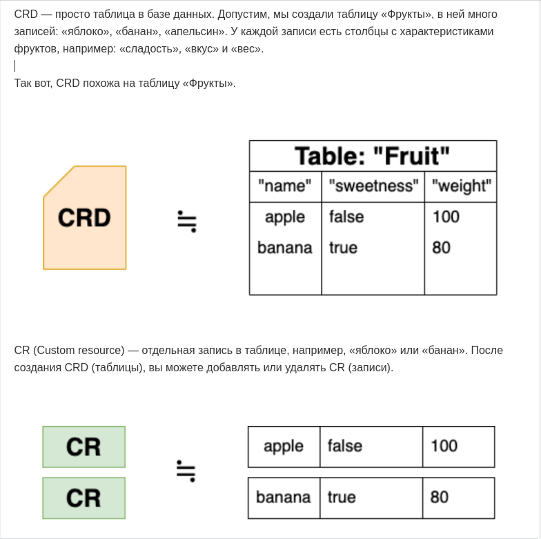
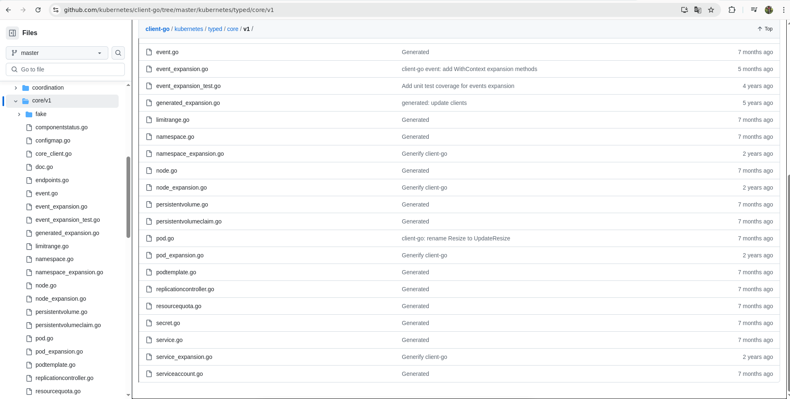
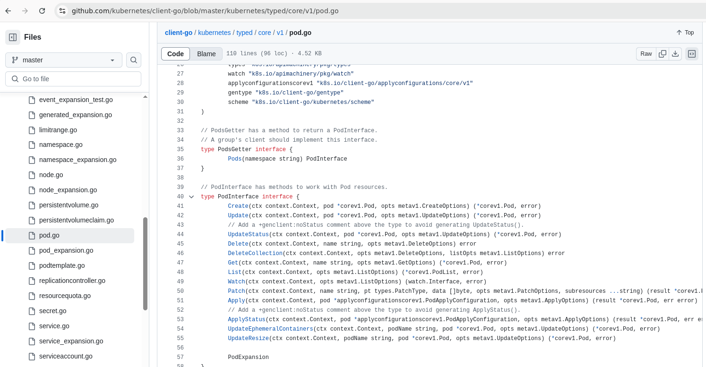
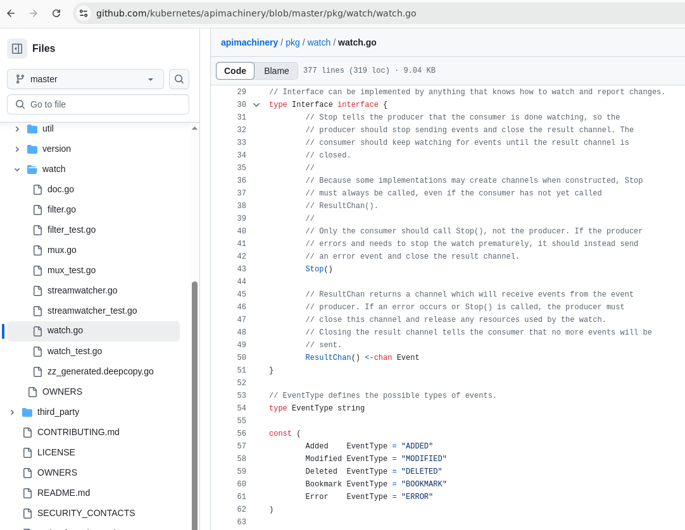

# Знакомимся с контроллерами и операторами kubernetes (k8s)

- [Знакомимся с контроллерами и операторами kubernetes (k8s)](#знакомимся-с-контроллерами-и-операторами-kubernetes-k8s)
  - [Начнем издали или договоримся о понятиях](#начнем-издали-или-договоримся-о-понятиях)
    - [Ресурс](#ресурс)
    - [kube-apiserver](#kube-apiserver)
    - [CRD](#crd)
    - [kube-controller-manager](#kube-controller-manager)
    - [controller vs operator](#controller-vs-operator)
    - [Watch](#watch)
    - [Informer](#informer)
  - [Навигация](#навигация)

## Начнем издали или договоримся о понятиях

Kubernetes это инструмент оркестрации, который имеет сложную структуру и при этом предусматривает возможность расширения своего функционала, за счет написания операторов. Перед тем как начать писать операторы, полезно понимать, как устроены некоторые части kubernetes а именно kube-controller-manager, kube api-server и какие функции они используют.

### Ресурс

Ресурс — это endpoint в API Kubernetes, которая хранит список объектов API определенного типа (kind). Примерами ресурсов является pod, deployment, configmap, rolebinding и т.д.

### kube-apiserver

В кластере k8s kube-apiserver запущен в качестве одного из подов кластера и слушает REST запросы по http протоколу. Пример запроса ресурса deployment в кластере:

```bash
$ KUBE_API=$(kubectl config view -o jsonpath='{.clusters[0].cluster.server}')
$ curl $KUBE_API/apis/apps/v1/deployments \
  --cacert ~/.minikube/ca.crt \
  --cert ~/.minikube/profiles/cluster1/client.crt \
  --key ~/.minikube/profiles/cluster1/client.key
{
  "kind": "DeploymentList",
  "apiVersion": "apps/v1",
  "metadata": {
    "resourceVersion": "654514"
  },
  "items": [...]
}
```

### CRD

CustomResourceDefinition это ресурс k8s, который позволяет описывать и создавать новые ресурсы (custom resource). Custom resources не стандартный ресурс kube api-server.

Более человеческим языком это звучит так: вся информация о ресурсах и k8s хранится в etcd (база данных). Можно сказать, что CustomResourceDefinition - таблица в базе данных. У таблицы есть различные поля, которые имеют свои характеристики (числа, строки, логические). Пример из интернета _(<https://habr.com/ru/companies/vk/articles/515138/>)_:



Манифест CRD включает в себя несколько элементов:

- apiVersion: определяет версию API Kubernetes, которая используется для CRD. Обычно это apiextensions.k8s.io/v1.
- kind: для CRD это всегда CustomResourceDefinition.
- metadata: содержит метаданные о CRD, включая уникальное имя.
- spec: основная часть определения CRD, где указывается конфигурация, включая группу, версию и область (Namespaced или Cluster).

Пример crd для ресурса fruit, файл crd-fruit.yaml .

```yaml
apiVersion: apiextensions.k8s.io/v1
kind: CustomResourceDefinition
metadata:
  name: fruits.user.k8sasdb.org
spec:
  conversion:
    strategy: None  # стратегия, как пользовательские ресурсы преобразуются между версиями
  group: user.k8sasdb.org # это группа API нового ресурса. Пользовательские ресурсы обслуживаются в /apis/\<group>/...
  names:
    kind: Fruit # тип, оно же имя ресурса
    listKind: FruitList
    plural: fruits
    singular: fruit
  scope: Namespaced # ресурс кластерный или он органичен внутри ns. Допустимые значения — Cluster и Namespaced.
  versions:
  - name: v1  # версия ресурса
    schema: # описание структуры нового ресурса
      openAPIV3Schema: # схема OpenAPI v3 для валидации и обрезки - https://kubernetes.io/docs/reference/kubernetes-api/extend-resources/custom-resource-definition-v1/#JSONSchemaProps
        properties:
          spec: # поле spec в ресурсе, описывается как объект
            properties: # поле .spec.properties , описывается как строка
              comment:
                type: string  # тип данных для .spec.properties
              sweetness:
                type: boolean
              weight:
                type: integer
            type: object
        type: object
    served: true
    storage: true
    subresources:
      status: {}
```

Развертывание crd в кластере выполняется командой `kubectl apply -f crd-fruit.yaml` Такой CRD создаст ресурс fruit. Пример фрукта яблоко, файл apple.yaml .

```yaml
apiVersion: user.k8sasdb.org/v1
kind: Fruit
metadata:
  name: apple
spec:
  sweetness: false
  weight: 100
  comment: little bit rotten
```

### kube-controller-manager

Ресурсы внутри k8s делятся на группы с разными версиями. В манифестах это выглядит так:

```yaml
apiVersion: apps/v1
kind: Deployment
```

где, apps - группа (group), v1 - версия, Deployment - сам ресурс.
У каждого ресурса есть свой контроллер, который управляет им. kube-controller-manager состоит из множества разделенных контроллеров и запущен в кластере k8s в качестве пода.

Пример контроллера в kube-controller-manager - это deployment controller. Deployment controller общается с kube-apiserver через api запросы, чтобы наблюдать за ресурсами deployment и использует следующие команды, при общении с kube-apiserver: call, pool, query. В самом deployment controller и api-server есть очереди. При создании ресурса deployment в кластере k8s, он отправляется в очередь api-server'а, а deployment controller при обращении к api-server последовательно проверяет очередь, не создан ли новый deployment. Когда контроллер найдет новый созданный deployment, он начнет запрашивать о нем информацию у api-server'а. Далее срабатывает логика контроллера по созданию replicaset. Аналогично обрабатываются события изменение или удаления ресурса deployment.

Как промежуточный итог, можно сказать что добавление нового контроллера, требует, с одной стороны отслеживаемый ресурс в api-server, с другой запущенную программу нового контроллера (как pod в кластере или просто как процесс, главное доступ к api-server). Если кластер должен отслеживать самописный ресурс, то необходимо сначала добавить этот ресурс в api-server с помощью CRD.

### controller vs operator

В интернете часто попадается, что контроллер тоже самое что и оператор, но это не совсем верно. Контроллер отвечает за ресурс k8s. Оператор отвечает за ресурс k8s + бизнес логика этого ресурса. В качестве примера можно рассмотреть оператор над кластером БД SQL (postges, mysql и тд.): мастер и 2 реплики. При увеличении количества реплик, оператор не только поднимает еще один pod с БД, но и решает, что нужно снять снапшет с мастера, как доставить снапшет на новую реплику, разворачивает снапшет на реплике.

### Watch

Если заглянуть в библиотеку client-go и зайти в файлы, имена которых совпадают с ресурсами k8s, (для примера открыть в pod.go), то можно увидеть, что внутри есть PodInterface , а у него есть метод Watch.


Watch в свою очередь вызывает watch.Interface .

Эта структура содержит в себе ResultChan() <-chan Event , т.е. передает по одному все события (update, create, delete), по наблюдаемому ресурсу (в данном примере по Pod) в программу которая использует библиотеку client-go. Для всех ресурсов, реализованных в библиотеке client-go, в интерфейсе ресурса есть метод Watch.

Данный метод подключается к очереди в kube api-server и получает из нее все события, по наблюдаемому объекту, но у этого метода есть существенный недостаток - он шлет много запросов. Если будет запущенно много Watch для разных объектов, то это вызовет замедление работы kube api-server. По этой причине Watch не используют в чистом виде, а вместо него используют Informer.

### Informer

Для уменьшения нагрузки на kube api-server у Informer есть собственный локальный кеш. Informer использует метод List, получает список наблюдаемых ресурсов из очереди в api-server и сохраняет их в свой кеш. Внутри Informer есть свой Watch, который опрашивает локальный кеш.

Informer опрашивает ресурсы только для одной группы. Если надо опрашивать разные группы ресурсов, то для каждой группы надо создать свой отдельный Informer или можно использовать один SharedInformerFactory. Пример создания Informer.

```go
  clientset, err := kubernetes.NewForConfig(config)
  if err != nil {
    // handle err
  }

  informerfactory := informers.NewSharedInformerFactory(clientset, 30*time.Second) // (4)
  informers.NewFilteredSharedInformerFactory(clientset, 10*time.Minute, "my-namespace", func(lo *metav1.ListOptions) {
    lo.LabelSelector = ""
  })

  podinformer := informerfactory.Core().V1().Pods()
  podinformer.Informer().AddEventHandler(cache.ResourceEventHandlerDetailedFuncs{
    AddFunc: func(new interface{}, isInInitialList bool) {  // (5)
      fmt.Println("add was called")
    },
      UpdateFunc: func(old, new interface{}) {   // (6)
    fmt.Println("update was calles")
    },
      DeleteFunc: func(obj interface{}) {    // (7)
    fmt.Println("delete was called")
    },
  })

  informerfactory.Start(wait.NeverStop)   // (1)
  informerfactory.WaitForCacheSync(wait.NeverStop)  // (2)
  pod, err := podinformer.Lister().Pods("default").Get("default") // (3)
```

При создании любого Informer создается его кеш. Инициализация же, заключается в отправке первого запроса к k8s api-server и получении ответа (строчки номер 1 и 2). Последующие запросы к api-server уже будут наблюдать за ресурсом (в примере за Pod). Строчка (3) обращается уже к кешу Informer, а не api-server. Если k8s api-server вернет ошибку на запрос, то время повторного запроса берется из строчки (4).

Функции (5), (6) и (7) вызываются сразу, как только событие оказывается в кеше Informer. Но возможно ложное срабатывание функции UpdateFunc (6) из-за сетевых сбоев и последующего восстановления кеша. По этому в функции (6) передаются 2 объекта, которые надо сравнить. Удобно сравнивать поля metadata.resourceVersion, чтобы быстро понять разные это ресурсы или копии одного и того же.

При работе с Informer кеш делает полную копию объекта. Если надо внести изменения в ресурс в кластере, то создается локальный объект с ресурсом в его итоговом виде, а потом он отправляется запросом на kube api-server.

## Навигация

- Организационная часть - требования по ПО, начальным знаниям и навигация по статье
  - [Требования](README.md#требования)
    - [Что нужно, перед тем как читать эту статью](README.md#что-нужно-перед-тем-как-читать-эту-статью)
    - [Используемые версии пакетов](README.md#используемые-версии-пакетов)
    - [Структура статьи](README.md#структура-статьи) 
- Теоретическая часть:
  - [Начнем издали или договоримся о понятиях](theoretical_part.md#начнем-издали-или-договоримся-о-понятиях) - некоторая информация по внутренней работе kubernetes, которая может быть полезной, для создания собственных контроллеров kubernetes.
    - [Ресурс](theoretical_part.md#ресурс)
    - [kube-apiserver](theoretical_part.md#kube-apiserver)
    - [CDR](theoretical_part.md#crd)
    - [kube-controller-manager](theoretical_part.md#kube-controller-manager)
    - [controller vs operator](theoretical_part.md#controller-vs-operator)
    - [Watch](theoretical_part.md#watch)
    - [Informer](theoretical_part.md#informer)
  - [Навигация](theoretical_part.md#навигация) **<- вы здесь.**
- Практическая часть поделена на несколько файлов:
  - [Практика - упрощаем написание контроллера с помощью kubebuilder (Простой путь)](kubebuilder_easy_way_p1.md#практика---упрощаем-написание-контроллера-с-помощью-kubebuilder-простой-путь)
    - [Учебная задача](kubebuilder_easy_way_p1.md#учебная-задача)
    - [План работы](kubebuilder_easy_way_p1.md#план-работы)
    - [1 - Что такое kubebuilder и архитектурная схема](theoretical_part.md#1---что-такое-kubebuilder-и-архитектурная-схема)
  - [Навигация](kubebuilder_easy_way_p1.md#навигация)
    - [2 - Пишем mvp контроллера](kubebuilder_easy_way_p2.md#2---пишем-mvp-контроллера)
      - [2.1 Создание проекта](kubebuilder_easy_way_p2.md#21-создание-проекта)
      - [2.2 Создание CRD и его добавление к k8s](kubebuilder_easy_way_p2.md#22-создание-crd-и-его-добавление-к-k8s)
      - [2.3 Логика работы контроллера и его запуск](kubebuilder_easy_way_p2.md#23-логика-работы-контроллера-и-его-запуск)
        - [2.3.1 Логика работы контроллера](kubebuilder_easy_way_p2.md#231-логика-работы-контроллера)
        - [2.3.2 Запуск контроллера](kubebuilder_easy_way_p2.md#232-запуск-контроллера)
      - [2.4 Добавление нового CR SecSynch, ns, secret](kubebuilder_easy_way_p2.md#24-добавление-нового-cr-secsynch-ns-secret)
  - [Навигация](kubebuilder_easy_way_p2.md#навигация)
    - [3 - Разбор проблем в mvp и приведение контроллера в соответствие с учебной задачей](kubebuilder_easy_way_p3.md#3---разбор-проблем-в-mvp-и-приведение-контроллера-в-соответствие-с-учебной-задачей)
      - [3.1 Удаление объекта `SecSynch secretsync-a` не удаляет скопированные секреты](kubebuilder_easy_way_p3.md#31-удаление-объекта-secsynch-secretsync-a-не-удаляет-скопированные-секреты)
      - [3.2 Обновление секрета `secret-a` не вызывает обновление уже созданных ранее секретов](kubebuilder_easy_way_p3.md#32-обновление-секрета-secret-a-не-вызывает-обновление-уже-созданных-ранее-секретов)
      - [3.3 Ложные срабатывания `Reconsille` на изменения ресурсов](kubebuilder_easy_way_p3.md#33-ложные-срабатывания-reconsille-на-изменения-ресурсов)
  - [Навигация](kubebuilder_easy_way_p3.md#навигация)

[Предыдущее](README.md)
[Далее](kubebuilder_easy_way_p1.md)
